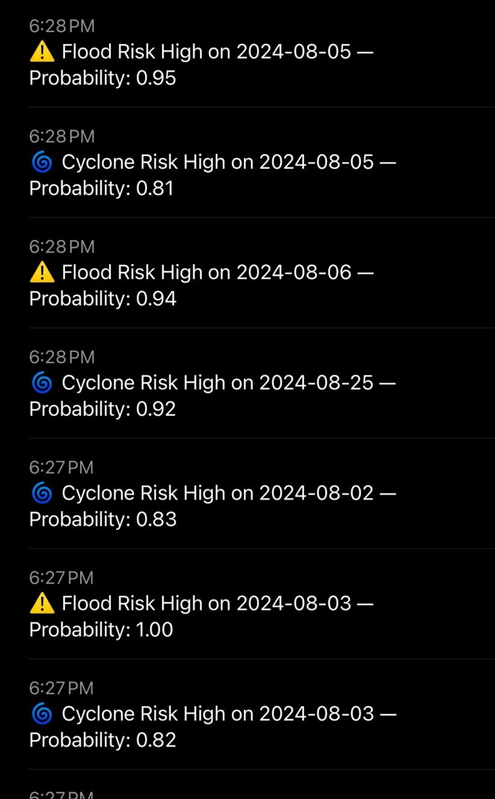
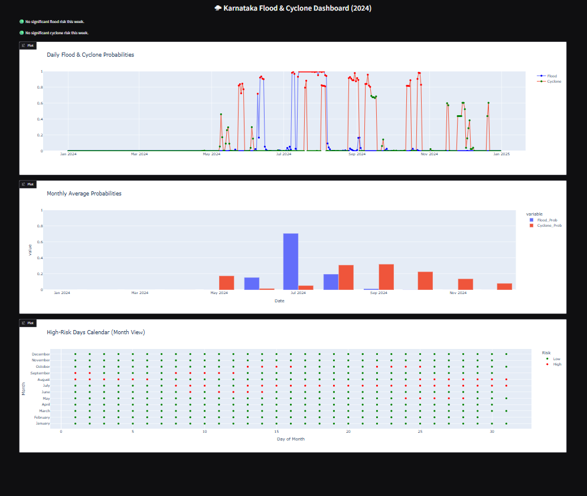

# **HydroShield-AI**
Machine learning based flood and cyclone risk prediction system for Karnataka using IMD daily rainfall and IBTrACS cyclone datasets. Includes Random Forest training scripts, push notification alerts and an interactive Gradio dashboard.


## Repository Structure
```
HydroShield-AI/
│── README.md
│── .gitattributes
│
├── datasets/
│   ├── KA_IMD_rainfall_2019_2023/       # Year-wise IMD rainfall CSVs
│   ├── KA_daily_2024.csv                # Latest IMD data (2024)
│   └── ibtracs.NI.list.v04r01.csv       # Cyclone track database
│
├── src/
│   ├── rf_flood.py                      # Flood-risk Random Forest model
│   ├── rf_cyclone.py                    # Cyclone-day prediction model
│   └── preprocessing.py                 # Utils for cleaning & merging data
│
├── models/
│   ├── rf_flood_all_years.joblib        # Saved flood model
│   └── rf_cyclone_all_years.joblib      # Saved cyclone model
│
├── outputs/
│   ├── KA_daily_predictions_2024.csv    # daily predictions output
│   └── KA_monthly_predictions_2024      # monthly predictions output
│
├── images/
│    ├── dashboard.png                   # dashboard image               
│    └── alerts.jpeg                     # alerts image 
│
└── notebook/
    └── Disaster_Prediction_Alerts_and_Dashboard.ipynb      # prediction, alerts and visualization notebook
```

## 1. Project Overview
HydroShield-AI is a lightweight hydrometeorological ML system that predicts:

### Flood-risk days
- Uses 2019–2023 IMD daily rainfall data  
- Computes cumulative 3-day, 7-day, and 10-day rainfall  
- Labels top 10% rainfall days as *“flood-positive”*  
- Trains a Random Forest for binary flood prediction  

### Cyclone-impact days
- Uses IBTrACS cyclone tracks over India (NI Basin)  
- Filters storms affecting Karnataka (lat/lon bounding box)  
- Merges daily wind/pressure with rainfall  
- Trains a Random Forest classifier to detect “cyclone days”  


## 2. Features Used in Modelling

### Flood Features
| Feature | Description |
|--------|-------------|
| `rain` | Daily rainfall (mm) |
| `rain3d` | Last 3 days cumulative rainfall |
| `rain7d` | Last 7 days cumulative rainfall |
| `rain10d` | Last 10 days cumulative rainfall |
| `doy` | Day of the year |
| `month` | Month index (seasonality) |

### Cyclone Features
| Feature | Description |
|--------|-------------|
| `Rainfall_mm` | Daily rainfall |
| `rain_3d, rain_7d, rain_10d` | Lag rainfall sums |
| `wind` | Max storm windspeed on that date |
| `pressure` | Min pressure on that date |


## 3. Training Scripts

### Flood Model 
`src/rf_flood.py`  
- Loads 2019–2023 rainfall CSVs  
- Creates rolling rainfall features  
- Defines flood labels using 90th percentile threshold  
- Trains a Random Forest (300 trees, depth 15)  
- Saves `models/rf_flood_all_years.joblib`

### Cyclone Model  
`src/rf_cyclone.py`  
- Loads rainfall + IBTrACS dataset  
- Filters cyclones affecting Karnataka  
- Merges wind & pressure with rainfall  
- Handles class imbalance using RandomOverSampler  
- Trains Random Forest  
- Saves `models/rf_cyclone_all_years.joblib`


## 4. How to Run the Models

### 1. Open project in VS Code
File → Open Folder → HydroShield-AI/
### 2. Create virtual environment
```bash
python -m venv venv
venv\Scripts\activate
```
### 3. Install dependencies
```bash
pip install pandas numpy scikit-learn imbalanced-learn joblib
```
### 4. Run training
```
python src/rf_flood.py
python src/rf_cyclone.py
```
Trained models(joblib files) in models/


## 5. Predictions & Alerts
- Use Colab notebook: notebook/Disaster_Prediction_Alerts_and_Dashboard.ipynb
- Predicts daily flood & cyclone probabilities for 2024
- Sends push notifications via ntfy if probability > 0.7
- Saves outputs:
    ```
    outputs/KA_daily_predictions_2024.csv
    outputs/KA_monthly_predictions_2024.csv
    ```
### ntfy push notifications:
```python
import requests

# NTFY SETTINGS
NTFY_TOPIC = "karnataka_disaster_alerts"
NTFY_URL = f"https://ntfy.sh/{NTFY_TOPIC}"

def send_alert(message):
    """Send push notification via ntfy"""
    try:
        requests.post(NTFY_URL, data=message.encode())
        print("ALERT SENT:", message)
    except:
        print("Error sending alert")

# Example: send alerts for each high-risk day
for i, row in df.iterrows():
    date_str = str(row['Date'].date())

    if row['Flood_Prob'] > 0.7:
        send_alert(f"⚠️ Flood Risk High on {date_str} — Probability: {row['Flood_Prob']:.2f}")

    if row['Cyclone_Prob'] > 0.7:
        send_alert(f"🌀 Cyclone Risk High on {date_str} — Probability: {row['Cyclone_Prob']:.2f}")
```



## 6. Gradio Dashboard
- Visualizes:
    - Daily flood & cyclone probabilities
    - Monthly averages
    - High-risk days calendar
    - Alerts for today and upcoming week
- Launch dashboard in notebook:
    ```python
    demo.launch(share=True)
    ```
Generates a public link to access the dashboard.




## 7. Outputs
- KA_daily_predictions_2024.csv – daily predictions with probabilities
- KA_monthly_predictions_2024.csv – monthly averages
- Push notifications via ntfy
- Interactive Gradio dashboard


## 8. References
- IMD Daily Rainfall Data: 
    - https://zenodo.org/records/11195106
    - https://www.imdpune.gov.in/cmpg/Griddata/Rainfall_25_NetCDF.html
- Cyclone Data: 
    - https://www.ncei.noaa.gov/products/international-best-track-archive


## 9. Developers
Team TempestAI, 
R.V. College of Engineering


